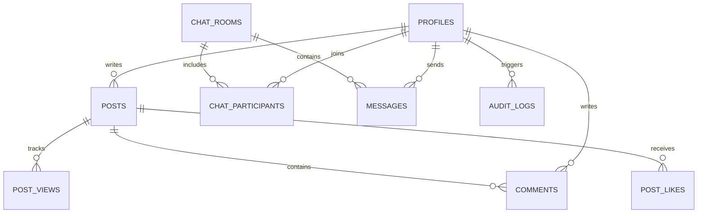

# 묵갤 (Mukho Gallery)

<div align="center">


**고성능 실시간 익명/회원 커뮤니티 갤러리 & WebSocket 메신저 웹 애플리케이션**

</div>

---

## 📌 프로젝트 소개 (Overview)

**묵갤(Mukho Gallery)**은 디시인사이드 특유의 빠르고 직관적인 갤러리 감성과 현대적인 실시간 메신저, 엄격한 엔터프라이즈급 보안 아키텍처를 결합한 차세대 커뮤니티 플랫폼입니다.

Next.js 16 App Router, React 19 Server Actions, Supabase PostgreSQL RLS, Realtime WebSocket(Dual-Channel), Cloudflare Turnstile, Upstash Redis 기반 Rate Limiting을 탑재하여 안전하고 지연 없는 사용자 경험을 제공합니다.

---

## ✨ 주요 기능 (Key Features)

### 1. 📋 커뮤니티 갤러리 (Gallery & Posts)

- **게시글 CRUD**: 텍스트 및 다중 이미지 업로드 지원 (Supabase Storage 연동)
- **소프트 삭제 & 복구**: 사용자가 삭제한 글은 보존되며, 관리자가 감사 및 복구 가능
- **3중 중복 추천 방지**: IP Hash(`SHA-256`) + 유저 ID + `HttpOnly` 쿠키 기반의 정밀 추천 시스템
- **조회수 어뷰징 방어**: 일일 단위 IP/유저 복합 식별을 통한 중복 조회수 증가 방지
- **댓글 시스템**: 실시간 댓글 작성, 본인/관리자 삭제 통제

### 2. 💬 실시간 채팅 메신저 (Real-Time Messenger)

- **1:1 및 단체 대화방**: 다자간 참여가 가능한 실시간 그룹 채팅 지원
- **0.01초 듀얼 채널(Dual-Channel) 파이프라인**:
  - `Supabase Realtime Broadcast` (0ms 즉시 전송) + `Postgres Changes` (영구 DB 2중 검증) 결합
- **👑 방장(Host) 권한 시스템**:
  - 참여자 목록 모달에 골드 **`👑 방장`** 뱃지 표시
  - 방장 전용 설정 모달: **채팅방 제목 변경** 및 **대표 이미지(사진) 업로드/변경**
  - 방 설정 변경 시 방 안의 모든 참여자 및 목록 화면에 **0.01초 실시간 동시 반영**
  - 타임라인에 `"{방장}님이 대화방 정보를 변경했습니다."` 시스템 메시지 자동 브로드캐스트
- **글로벌 미확인 알림**: 하단 네비게이션 바(BottomNav)에 실시간 안 읽은 메시지 카운트 및 펄스 레드 닷 배지 연동
- **미디어 전송**: 대화방 내 고화질 사진 첨부 및 미리보기 지원

### 3. 🛡️ 보안 & 인증 (Security & Auth Architecture)

- **이메일 인증 & OTP**: 8자리 인증 코드 입력 및 확인 링크(`callback`) 동시 지원
- **실시간 중복/형식 검증**: RFC 표준 이메일 정규식 검증, 닉네임 실시간 중복 확인
- **예약어 및 권한 상승 차단**: 관리자 사칭 방지(`mukho`, `admin`, `운영자` 등) 및 프로필 수정을 통한 권한 탈취 원천 차단
- **Rate Limiting (속도 제한)**: 슬라이딩 윈도우 알고리즘으로 Brute-force 및 스팸 차단
  - 로그인(10회/분), 회원가입(5회/5분), OTP 재발송(3회/5분), 글 작성(5건/분), 댓글(15건/분), 채팅(30건/분)
- **봇 방어**: Cloudflare Turnstile 캡차 검증 탑재
- **Row Level Security (RLS)**: PostgreSQL의 8개 테이블 전원에 RLS 정책 강제 적용 (참여자만 채팅/메시지 접근 가능)

### 4. 👑 관리자 대시보드 (Admin Dashboard)

- **실시간 통계**: 총 회원 수, 활성/삭제 게시글, 총 댓글 수, 감사 로그 카운트
- **삭제된 콘텐츠 관리**: 삭제된 글/댓글 목록 조회 및 원클릭 복구
- **영구 감사 로그 (`audit_logs`)**: 로그인, 회원가입, 글/댓글/채팅방 변경 이력의 IP, Actor, Target 상세 추적

### 5. 📱 모던 UI/UX & PWA

- **다크 테마 디자인**: 디시인사이드 스타일의 고대비 다크 테마 및 유리 효과(Backdrop Blur)
- **반응형 하단 네비게이션**: 모바일 앱에 최적화된 직관적인 탭 바
- **PWA 지원**: `manifest.json` 및 서비스 워커를 통한 홈 화면 앱 설치 지원

---

## 🛠️ 기술 스택 (Tech Stack)

| 구분                 | 기술 및 라이브러리                                          |
| :------------------- | :---------------------------------------------------------- |
| **Framework**        | Next.js 16.3.2 (App Router, Server Actions, Route Handlers) |
| **Language**         | TypeScript 5.0                                              |
| **Frontend**         | React 19.2.8, Tailwind CSS v4, Lucide React, CVA, clsx      |
| **Backend & DB**     | Supabase (PostgreSQL 15, Auth, Storage, Realtime WebSocket) |
| **Security & Infra** | Cloudflare Turnstile, Upstash Redis, Zod, Node Crypto       |
| **PWA**              | Web App Manifest, Service Worker                            |

---

## 🗄️ 데이터베이스 구조 (Database Schema)



### 주요 테이블 목록

- `profiles`: 유저 정보, 닉네임, 아바타, 소개, 권한(`USER` / `ADMIN`)
- `posts`: 게시글 본문, 첨부 이미지 배열, 추천수, 소프트 삭제(`deleted_at`)
- `comments`: 게시글 댓글, 작성자, 소프트 삭제
- `chat_rooms`: 1:1/그룹 채팅방, 방 이름, 대표 이미지(`avatar_url`), 개설자(`created_by`)
- `chat_participants`: 방 참여자, 입장 시점, 마지막 읽은 시간(`last_read_at`), 퇴장 여부(`left_at`)
- `messages`: 채팅 메시지, 텍스트/이미지/시스템 타입, 보낸이
- `audit_logs`: 보안 및 관리자 활동 기록
- `post_likes` / `post_views`: 추천 및 조회수 기록

---

## 🚀 시작하기 (Getting Started)

### 1. 레포지토리 클론 및 의존성 설치

```bash
git clone https://github.com/fakeengineer333/mukgall.git
cd mukgall
npm install
```

### 2. 환경 변수 설정 (`.env.local`)

프로젝트 루트 디렉토리에 `.env.local` 파일을 생성하고 아래 항목을 입력합니다:

```env
# Supabase Configuration
NEXT_PUBLIC_SUPABASE_URL=https://your-project.supabase.co
NEXT_PUBLIC_SUPABASE_ANON_KEY=your-anon-key
SUPABASE_SERVICE_ROLE_KEY=your-service-role-key

# App URL
NEXT_PUBLIC_APP_URL=http://localhost:3000

# Cloudflare Turnstile (선택 - 미설정 시 개발 모드 자동 패스)
NEXT_PUBLIC_TURNSTILE_SITE_KEY=your-turnstile-site-key
TURNSTILE_SECRET_KEY=your-turnstile-secret-key

# Upstash Redis (선택 - 미설정 시 인메모리 레이트 리밋 자동 폴백)
UPSTASH_REDIS_REST_URL=https://your-redis.upstash.io
UPSTASH_REDIS_REST_TOKEN=your-redis-token
```

### 3. 로컬 개발 서버 실행

```bash
npm run dev
```

브라우저에서 [http://localhost:3000](http://localhost:3000)으로 접속합니다.

### 4. 프로덕션 빌드

```bash
npm run build
npm run start
```

---

## 📜 버전 이력 (Changelog)

### `v0.1.4` (2026-08-25)
- **🎨 채팅방 헤더 여백 및 스크롤 레이아웃 최적화**
  - 개별 대화방(`/chat/[id]`) 상단에 존재하던 불필요한 공백(`top-14` 오프셋) 제거 및 헤더 플러시 고정
  - 외부 페이지 스크롤 글리치를 방지하기 위해 컨테이너 높이(`100dvh`) 및 `overscroll-contain` 적용으로 대화방 내부 메시지 스크롤만 부드럽게 작동하도록 UX 완성
- **🛡️ PWA Service Worker 내비게이션 바이패스 및 ERR_CACHE_MISS 해결**
  - 서비스 워커의 무차별 페이지 이동 가로채기를 제거하여 동적 SSR 라우트(`/chat`, `/mypage` 등) 접속 안정성 100% 확보

### `v0.1.3` (2026-08-25)
- **⚡ 메시지 탭(`/chat`) 초기 진입 및 새로고침 시 실시간 웹소켓 수신 버그 해결**
  - 초기 진입/새로고침 시 메시지 목록 및 안읽은 카운트가 갱신되지 않던 원인 파악 (방 내부 Broadcast만 전송되고 전역 Broadcast 채널 및 REPLICA IDENTITY 누락)
  - `global_chat_sync` 전역 Broadcast 채널을 신설하여, 메시지 전송 시 0.001초만에 `/chat` 대화방 목록 최상단 이동, 미리보기 문구 갱신, 미확인 배지 카운트 증가가 실시간 반영되도록 듀얼 채널(Broadcast + Postgres Changes) 구조 전면 확장
  - 하단 네비게이션 바(`BottomNav`)도 `global_chat_sync`와 즉시 연동하여 실시간 레드 닷 / 뱃지가 딜레이 없이 동기화되도록 개선
  - `messages`, `chat_rooms`, `chat_participants` 테이블의 `supabase_realtime` Publication 및 `REPLICA IDENTITY FULL` 마이그레이션 보강

### `v0.1.2` (2026-08-25)
- **✨ 로그인 & 회원가입 UI/UX 전면 개편**
  - 타이틀 간소화: `묵호 갤러리 로그인/회원가입` ➜ `로그인` / `회원가입`
  - 링크 범위 정밀화: 타이틀 텍스트의 링크를 제거하고 상단 **'묵갤' 앱 아이콘 클릭 시에만 메인 페이지로 이동**하도록 수정
  - 비밀번호 입력 개선: 인풋 내부 우측에 **비밀번호 보이기/숨기기(Eye/EyeOff) 토글 아이콘** 추가 및 6자 미만 입력 시 실시간 유효성 경고 안내
  - 닉네임/이메일 입력창: 불필요한 '중복 확인' 버튼 텍스트를 제거하고 입력 포커스 아웃(onBlur) 기반 자동 실시간 중복 검증 피드백으로 정돈
- **📧 이메일 인증(OTP) 화면 UX 최적화**
  - 인증 안내 문구 간소화: 혼선을 주던 링크 클릭 안내를 제거하고 메일 본문의 8자리 코드 입력 안내로 일원화
  - 인증 코드 인풋 레이블 및 플레이스홀더(`********`) 정리
  - 버튼 문구 변경: `인증 코드로 완료하기` ➜ `인증하기`
  - 상태 전환 버그 수정: `정보 다시 입력` 클릭 시 `stepOverride`를 통해 즉시 회원가입 폼으로 원활히 복귀하도록 개선

### `v0.1.1` (2026-08-24)
- **🎨 PWA 모바일 아이콘 & 스플래시 가시성 전면 개선**
  - 어두운 스마트폰 화면 및 스플래시 배경에서 아이콘이 보이지 않던 문제 해결
  - 다크 스퀘어클 플레이트(그라데이션 보더) + 순백색(`fill="#FFFFFF"`) '묵' 캘리그래피 심볼 디자인 적용
  - `icon-192.png`, `icon-512.png` 고해상도 렌더링 및 `manifest.json` `maskable any` 완벽 지원
  - PWA 설치 안내 팝업, 상단 글로벌 헤더, 메인 히어로 배너, 로그인/회원가입 화면에 공식 앱 아이콘 일괄 적용
- **🛡️ 보안 강화 (Security Hardening)**
  - 프로필 수정 시 권한 상승(Role Escalation) 차단 및 닉네임 변경 시 예약어/중복 실시간 방어
  - 게시글/댓글 삭제 시 `adminClient` Fallback에 엄격한 `isAdmin` 가드 적용 (비관리자 타인 글 삭제 원천 차단)
  - 로그인(10회/분), 회원가입(5회/5분), 이메일 OTP 재발송(3회/5분) 엔드포인트에 슬라이딩 윈도우 Rate Limiting 적용
- **⚡ 실시간 메신저 파이프라인 고도화**
  - 단체 대화방 참여자 목록 내 `👑 방장` 골드 뱃지 표시
  - 방장 전용 채팅방 제목 및 대표 이미지 설정 모달 및 원자적 `update_chat_room` RPC 프로시저 연동
  - 0.01초 듀얼 채널(Realtime Broadcast + Postgres Changes)을 통한 대화방 설정 및 메시지 전원 실시간 동시 반영
- **🔧 TypeScript 빌드 및 타입 안정성 개선**
  - `middleware.ts` 및 `server.ts`의 SSR `cookiesToSet` 매개변수 명시적 타입 주입 (`TS7006`, `TS7031` 에러 해결)

### `v0.1.0` (2026-08-24)
- **최초 릴리즈 (Initial Release)**
  - 갤러리 게시판 (CRUD, 3중 중복 추천 방지, 이미지 업로드, 조회수 집계)
  - 1:1 및 단체 실시간 메신저 (0.01초 듀얼 채널 WebSocket)
  - 하단바 실시간 미확인 메시지 뱃지 & 레드 닷
  - 8자리 OTP 이메일 인증 & 콜백 핸들러
  - 관리자 대시보드 및 감사 로그(`audit_logs`) 시스템
  - Turnstile 봇 방어 및 PostgreSQL RLS 보안 적용

---

## 📄 라이선스 (License)

This project is licensed under the MIT License.
