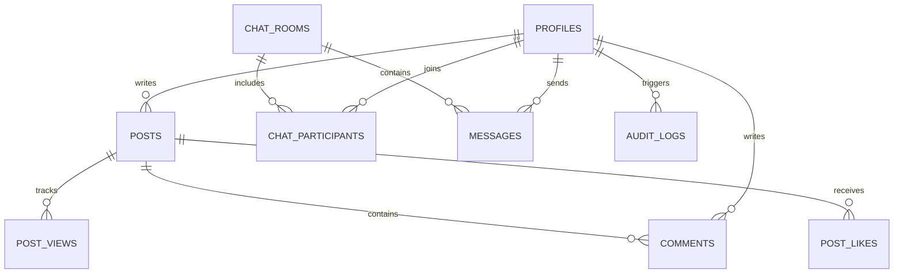

# 묵갤 (Mukho Gallery)

<div align="center">


**고성능 실시간 익명/회원 커뮤니티 갤러리 & WebSocket 메신저 웹 애플리케이션**

</div>

---

## 📌 프로젝트 소개 (Overview)

**묵갤(Mukho Gallery)**은 디시인사이드 특유의 빠르고 직관적인 갤러리 감성과 현대적인 실시간 메신저, 엄격한 엔터프라이즈급 보안 아키텍처를 결합한 차세대 커뮤니티 플랫폼입니다.

Next.js 16 App Router, React 19 Server Actions, Supabase PostgreSQL RLS, Realtime WebSocket(Dual-Channel), Cloudflare Turnstile, Upstash Redis 기반 Rate Limiting을 탑재하여 안전하고 지연 없는 사용자 경험을 제공합니다.

---

## ✨ 주요 기능 (Key Features)

### 1. 📋 커뮤니티 갤러리 (Gallery & Posts)

- **게시글 CRUD**: 텍스트 및 다중 이미지 업로드 지원 (Supabase Storage 연동)
- **소프트 삭제 & 복구**: 사용자가 삭제한 글은 보존되며, 관리자가 감사 및 복구 가능
- **3중 중복 추천 방지**: IP Hash(`SHA-256`) + 유저 ID + `HttpOnly` 쿠키 기반의 정밀 추천 시스템
- **조회수 어뷰징 방어**: 일일 단위 IP/유저 복합 식별을 통한 중복 조회수 증가 방지
- **댓글 시스템**: 실시간 댓글 작성, 본인/관리자 삭제 통제

### 2. 💬 실시간 채팅 메신저 (Real-Time Messenger)

- **1:1 및 단체 대화방**: 다자간 참여가 가능한 실시간 그룹 채팅 지원
- **0.01초 듀얼 채널(Dual-Channel) 파이프라인**:
  - `Supabase Realtime Broadcast` (0ms 즉시 전송) + `Postgres Changes` (영구 DB 2중 검증) 결합
- **👑 방장(Host) 권한 시스템**:
  - 참여자 목록 모달에 골드 **`👑 방장`** 뱃지 표시
  - 방장 전용 설정 모달: **채팅방 제목 변경** 및 **대표 이미지(사진) 업로드/변경**
  - 방 설정 변경 시 방 안의 모든 참여자 및 목록 화면에 **0.01초 실시간 동시 반영**
  - 타임라인에 `"{방장}님이 대화방 정보를 변경했습니다."` 시스템 메시지 자동 브로드캐스트
- **글로벌 미확인 알림**: 하단 네비게이션 바(BottomNav)에 실시간 안 읽은 메시지 카운트 및 펄스 레드 닷 배지 연동
- **미디어 전송**: 대화방 내 고화질 사진 첨부 및 미리보기 지원

### 3. 🛡️ 보안 & 인증 (Security & Auth Architecture)

- **이메일 인증 & OTP**: 8자리 인증 코드 입력 및 확인 링크(`callback`) 동시 지원
- **실시간 중복/형식 검증**: RFC 표준 이메일 정규식 검증, 닉네임 실시간 중복 확인
- **예약어 및 권한 상승 차단**: 관리자 사칭 방지(`mukho`, `admin`, `운영자` 등) 및 프로필 수정을 통한 권한 탈취 원천 차단
- **Rate Limiting (속도 제한)**: 슬라이딩 윈도우 알고리즘으로 Brute-force 및 스팸 차단
  - 로그인(10회/분), 회원가입(5회/5분), OTP 재발송(3회/5분), 글 작성(5건/분), 댓글(15건/분), 채팅(30건/분)
- **봇 방어**: Cloudflare Turnstile 캡차 검증 탑재
- **Row Level Security (RLS)**: PostgreSQL의 8개 테이블 전원에 RLS 정책 강제 적용 (참여자만 채팅/메시지 접근 가능)

### 4. 👑 관리자 대시보드 (Admin Dashboard)

- **실시간 통계**: 총 회원 수, 활성/삭제 게시글, 총 댓글 수, 감사 로그 카운트
- **삭제된 콘텐츠 관리**: 삭제된 글/댓글 목록 조회 및 원클릭 복구
- **영구 감사 로그 (`audit_logs`)**: 로그인, 회원가입, 글/댓글/채팅방 변경 이력의 IP, Actor, Target 상세 추적

### 5. 📱 모던 UI/UX & PWA

- **다크 테마 디자인**: 디시인사이드 스타일의 고대비 다크 테마 및 유리 효과(Backdrop Blur)
- **반응형 하단 네비게이션**: 모바일 앱에 최적화된 직관적인 탭 바
- **PWA 지원**: `manifest.json` 및 서비스 워커를 통한 홈 화면 앱 설치 지원

---

## 🛠️ 기술 스택 (Tech Stack)

| 구분                 | 기술 및 라이브러리                                          |
| :------------------- | :---------------------------------------------------------- |
| **Framework**        | Next.js 16.3.2 (App Router, Server Actions, Route Handlers) |
| **Language**         | TypeScript 5.0                                              |
| **Frontend**         | React 19.2.8, Tailwind CSS v4, Lucide React, CVA, clsx      |
| **Backend & DB**     | Supabase (PostgreSQL 15, Auth, Storage, Realtime WebSocket) |
| **Security & Infra** | Cloudflare Turnstile, Upstash Redis, Zod, Node Crypto       |
| **PWA**              | Web App Manifest, Service Worker                            |

---

## 🗄️ 데이터베이스 구조 (Database Schema)



### 주요 테이블 목록

- `profiles`: 유저 정보, 닉네임, 아바타, 소개, 권한(`USER` / `ADMIN`)
- `posts`: 게시글 본문, 첨부 이미지 배열, 추천수, 소프트 삭제(`deleted_at`)
- `comments`: 게시글 댓글, 작성자, 소프트 삭제
- `chat_rooms`: 1:1/그룹 채팅방, 방 이름, 대표 이미지(`avatar_url`), 개설자(`created_by`)
- `chat_participants`: 방 참여자, 입장 시점, 마지막 읽은 시간(`last_read_at`), 퇴장 여부(`left_at`)
- `messages`: 채팅 메시지, 텍스트/이미지/시스템 타입, 보낸이
- `audit_logs`: 보안 및 관리자 활동 기록
- `post_likes` / `post_views`: 추천 및 조회수 기록

---

## 🚀 시작하기 (Getting Started)

### 1. 레포지토리 클론 및 의존성 설치

```bash
git clone https://github.com/fakeengineer333/mukgall.git
cd mukgall
npm install
```

### 2. 환경 변수 설정 (`.env.local`)

프로젝트 루트 디렉토리에 `.env.local` 파일을 생성하고 아래 항목을 입력합니다:

```env
# Supabase Configuration
NEXT_PUBLIC_SUPABASE_URL=https://your-project.supabase.co
NEXT_PUBLIC_SUPABASE_ANON_KEY=your-anon-key
SUPABASE_SERVICE_ROLE_KEY=your-service-role-key

# App URL
NEXT_PUBLIC_APP_URL=http://localhost:3000

# Cloudflare Turnstile (선택 - 미설정 시 개발 모드 자동 패스)
NEXT_PUBLIC_TURNSTILE_SITE_KEY=your-turnstile-site-key
TURNSTILE_SECRET_KEY=your-turnstile-secret-key

# Upstash Redis (선택 - 미설정 시 인메모리 레이트 리밋 자동 폴백)
UPSTASH_REDIS_REST_URL=https://your-redis.upstash.io
UPSTASH_REDIS_REST_TOKEN=your-redis-token
```

### 3. 로컬 개발 서버 실행

```bash
npm run dev
```

브라우저에서 [http://localhost:3000](http://localhost:3000)으로 접속합니다.

### 4. 프로덕션 빌드

```bash
npm run build
npm run start
```

---

## 📜 버전 이력 (Changelog)

### `v0.4.4` (2026-08-26)
- **🖼️ 대화방 목록 이미지 첨부 미리보기 텍스트 개선**
  - 대화방 목록([`ChatRoomList.tsx`](file:///Users/mukho/Desktop/mukgall/src/components/chat/ChatRoomList.tsx))에서 이미지만 전송되었을 때의 미리보기 문구를 `[사진 첨부]` ➜ **`사진을 보냈습니다.`**로 변경하여 모바일/웹 메신저 표준 사용자 경험 제공

### `v0.4.3` (2026-08-26)
- **🛡️ 마이페이지 닉네임 실시간 중복 확인 & 수정 방지 유효성 검사 구축**
  - 회원가입과 동일하게 마이페이지 프로필 수정 모달([`ProfileEditModal.tsx`](file:///Users/mukho/Desktop/mukgall/src/components/profile/ProfileEditModal.tsx))에서 닉네임 입력/포커스 아웃 시 실시간 중복 체크 실행
  - 본인의 기존 닉네임은 정상 허용하며, 타 유저가 이미 사용 중인 닉네임 또는 예약어인 경우 하단에 즉시 경고 메시지 표시
  - 중복되었거나 유효하지 않은 닉네임인 경우 '저장하기' 버튼 비활성화(Disabled) 처리로 무결성 보장

### `v0.4.2` (2026-08-26)
- **💬 채팅 날짜 구분선 포맷 친화적 한글화 (`yyyy년 MM월 dd일 *요일`)**
  - 대화창 날짜 구분선 형식을 `2026-08-26 수요일` ➜ **`2026년 08월 26일 수요일`**로 가독성 높게 개편
- **👤 마이페이지 프로필 UI 정돈**
  - 일반 유저 대상 불필요한 '일반 유저' 뱃지 제거 및 관리자 뱃지만 깔끔하게 노출
  - '알림 설정', '프로필 수정' 액션 버튼의 상단 패딩(`pt-4 sm:pt-5`)을 늘려 아바타와의 시각적 간격 및 레이아웃 안정성 확보
- **📱 PWA 앱 설치 배너 노출 주기 최적화 (7일간 닫기)**
  - 닫기(`X`) 클릭 시 `localStorage`에 7일간 숨김 상태를 저장하여 페이지를 이동하거나 새로고침할 때마다 반복해서 뜨던 현상 완벽 해결

### `v0.4.1` (2026-08-26)
- **🚀 메인 화면 오버페칭 제거 & 온디맨드(On-Demand) 지연 로딩 파이프라인 구축**
  - 초기 메인 화면 진입 시 오직 **[갤러리 글 목록]**만 단일 쿼리로 초고속 페칭하고, 대화방 목록과 마이페이지 데이터는 탭 클릭 시 온디맨드로 지연 조회하도록 분리
  - 초기 서버사이드 렌더링(SSR) 쿼리량을 1/3로 축소하여 첫 로딩 속도 극대화
  - 상단 프로그레스 바(`TopProgressBar`) 애니메이션을 하드웨어 가속 `transform: translateX`로 고도화하여 100% 화면 끝까지 안정적으로 렌더링되도록 개선

### `v0.4.0` (2026-08-26)
- **⚡ 전면적인 병렬 쿼리 파이프라인 & 0.02초 Instant Shimmer Skeleton (`loading.tsx`) 스트리밍 구축**
  - **React `cache()` 서버 인증 중복 제거**: `layout.tsx`와 `page.tsx` 간의 Supabase Auth 중복 조회를 단 1회로 통합하여 TTFB 대폭 단축
  - **전 라우트 DB 쿼리 완전 병렬화 (`Promise.all`)**: 메인 피드, 게시글 상세(`/posts/[id]`), 대화방(`/chat/[id]`), 관리자 페이지의 순차적 워터폴 대기를 1회 병렬 배치로 통합
  - **초고속 네이티브 스켈레톤 스트리밍 (`loading.tsx`) 탑재**: 메인 화면, 게시글 상세, 대화방, 관리자 전 화면에 실물 디자인과 일치하는 Shimmer 스켈레톤 적용으로 클릭 즉시 0.02초 만에 UI 뼈대 렌더링
  - **상단 네비게이션 프로그레스 바 (`TopProgressBar.tsx`)**: 페이지 이동 시 0.00초 즉시 시각적 반응을 주는 슬림 프로그레스 바 연동

### `v0.3.3` (2026-08-25)
- **🎨 메인 히어로 배너 문구 및 디자인 간소화**
  - 메인 히어로 배너의 'DC 스타일' 뱃지 제거 및 서브 타이틀을 **'반갑다. 묵호 갤러리다.'**로 심플하고 직관적이게 수정

### `v0.3.2` (2026-08-25)
- **🌓 전 화면 라이트/다크 모드 가독성 및 명도 대비(Color Contrast) 전수 최적화**
  - 라이트 모드 환경에서 메인 탭(메시지, 마이페이지), DC 게시판 목록, 대화방 목록, 게시글 상세 및 댓글, 모달 창 등의 글자가 흰색으로 묻혀 보이지 않던 이슈 전수 해결
  - `text-zinc-900 dark:text-white`, `border-zinc-200 dark:border-zinc-800`, `bg-white dark:bg-zinc-900` 등 시스템 테마에 맞는 정밀한 이중 토큰 체계 적용
  - 시스템 테마(`prefers-color-scheme`) 변경 시 즉각적이고 자연스러운 테마 전환 지원

### `v0.3.1` (2026-08-25)
- **🏠 상단 헤더 로고 및 로그인/회원가입 아이콘 클릭 시 메인 갤러리 탭 즉시 이동 연동**
  - 상단 헤더의 '묵호 갤러리' 로고 클릭 시 어떤 화면/탭에서든 메인 화면의 **갤러리 탭**으로 0.000초 즉시 전환 및 상단 스크롤 복귀 지원
  - 로그인 / 회원가입 / 이메일 인증 화면의 로고 아이콘 클릭 시에도 메인 갤러리 탭으로 자연스럽게 복귀하도록 통일

### `v0.3.0` (2026-08-25)
- **🚀 하이브리드 고속 탭 전환 (Hybrid Instant Tab Switching & Keep-Alive) 시스템 구축**
  - 하단 네비게이션 3대 탭(갤러리 ↔ 메시지 ↔ 마이페이지)을 React 상태 기반 무지연 0.000초 인메모리 스위칭으로 개편
  - **스크롤 및 상태 보존(Keep-Alive)**: 갤러리 글 목록을 스크롤하던 중 메시지/마이페이지 탭을 다녀와도 스크롤 위치 및 검색 상태가 100% 보존됨
  - **히스토리 및 URL 동기화**: `window.history.pushState` 및 `popstate` 연동으로 브라우저/스마트폰 '뒤로가기' 누름 시 앱 밖으로 나가지 않고 이전 탭으로 자연스럽게 복귀
  - **웹 스펙 완벽 준수**: 게시글 상세(`/posts/[id]`) 및 특정 대화방(`/chat/[id]`)은 고유 URL과 SSR을 유지하여 카카오톡 링크 공유 및 OG 미리보기 100% 유지

### `v0.2.3` (2026-08-25)
- **⚡ 0.000초 즉시 전송 낙관적 UI (Optimistic UI) 메신저 시스템 탑재**
  - 엔터/전송 버튼을 누르는 순간 0.000ms 즉시 화면에 말풍선을 렌더링하고 입력창을 비워 카카오톡/텔레그램급 물 흐르는 연속 타이핑 지원
  - 서버 저장은 백그라운드 비동기로 처리되며, 데이터베이스 확정 시 부드럽게 실제 ID로 무지연 매칭 Reconcile
  - 실시간 수신 시 참여자 프로필 메모리 캐시 패스트패스를 적용하여 추가 HTTP 요청 없이 광속 렌더링

### `v0.2.2` (2026-08-25)
- **💬 푸시 알림 우측 아이콘에 채팅방/보낸 사람 아바타 아이콘 적용**
  - 알림 수신 시 우측 큰 썸네일에 기본 앱 로고 대신 **채팅방 전용 아이콘(`icon-chat.png`)** 또는 **보낸 사람의 프로필 아바타**가 표시되도록 개선
- **⚡ Supabase Realtime Deprecation Warning 콘솔 경고 해결**
  - 미구독 브로드캐스트 채널 전송 폴백을 제거하고 순수 데이터베이스 WAL 스트림 기반 동기화로 일원화하여 `Realtime send() fallback to REST API` 경고 완전 제거

### `v0.2.1` (2026-08-25)
- **🛠️ 갤러리 탭 하이드레이션 불일치(React Error #418) 및 DevTools 팝오버 오류 원천 해결**
  - 서버(Node.js)와 클라이언트(브라우저) 간 타임존 차이로 발생하던 게시글 작성 시각 텍스트 불일치 해결 (`Asia/Seoul` 표준화 및 `suppressHydrationWarning` 적용)
- **🔔 안드로이드 스마트폰 상태바 회색 네모 알림 아이콘 해결**
  - 안드로이드 OS 알파 마스크 규격에 맞춘 전용 투명 배경 흑백 실루엣 뱃지(`badge-96.png`) 제작 및 Web Notification API 연동
- **🎨 라이트/다크 모드 읽음 확인 숫자('1') 시인성 테마 분기 적용**
  - 라이트 모드(흰 배경)에서는 선명한 `amber-600` 골드 톤, 다크 모드(검은 배경)에서는 화사한 `yellow-400` 레몬 톤으로 자동 전환

### `v0.2.0` (2026-08-25)
- **👀 카카오톡 스타일 실시간 '1' 읽음 확인(Read Receipt) 시스템 탑재**
  - 내가 보낸 메시지 옆에 노란색 숫자 `1`이 표시되며, 상대방이 대화방에 입장하여 메시지를 읽는 순간 웹소켓을 통해 실시간으로 `1`이 즉시 사라지도록 구현
  - 그룹 대화방에서는 아직 읽지 않은 참여자 수가 카운팅되며, 참여자별 `last_read_at` 갱신에 따라 실시간 감소
  - 불필요한 주기적 폴링(`setInterval`)을 완전히 걷어내고 순수 실시간 이벤트 기반으로 최적화

### `v0.1.9` (2026-08-25)
- **📜 대화방 메시지 페이징(위로 스크롤 시 이전 대화 불러오기) 구현**
  - 초기 진입 시 최신 30개 메시지만 우선 불러와 초기 렌더링 성능을 극대화
  - 대화창 상단으로 스크롤 시 `fetchOlderMessagesAction`을 통해 이전 30개씩 부드럽게 무한 스크롤(Infinite Scroll Up) 로딩 및 스크롤 위치 유지
- **📅 날짜 변경 시 'yyyy-MM-dd 요일' 구분선 배너 자동 삽입**
  - 날짜가 바뀌는 시점마다 중앙에 깔끔한 날짜 구분선(`2026-08-25 화요일` 형식)을 렌더링하여 가독성 강화
- **⏱️ 주기적 동기화 간격 최적화 & 대화방 목록 최신순 절대 정렬 보장**
  - 자동 Catch-Up 주기 3초 ➜ 10초로 최적화하여 서버 부하 및 배터리 소모 대폭 경감
  - 대화방 목록(`/chat`)에서 실시간/새로고침/첫 진입 모두 가장 최근 메시지가 있는 방이 무조건 최상단에 오도록 엄격 보장

### `v0.1.8` (2026-08-25)
- **⚡ 대화방 목록 최신 메시지 순 정렬 및 새로고침 후 실시간 갱신 완벽 개선**
  - 대화방 목록(`/chat`) 접속 및 새로고침 시 가장 최근 메시지가 온 방이 최상단에 위치하도록 서버(`SSR`) 및 클라이언트 정렬 로직 표준화
  - `ChatProvider`에서 소켓 연결 전 `supabase.realtime.setAuth` 비동기 완료를 보장하고, `latestMessage` 스트림을 통해 목록 페이지가 즉각 반응하여 방을 최상단으로 재배치하도록 연동
  - 3초 주기 자동 Catch-Up sync를 적용하여 네트워크 지연 시에도 메시지 및 방 목록이 항상 100% 무결성을 유지하도록 보강

### `v0.1.7` (2026-08-25)
- **💎 React Context API 기반 전역 `ChatProvider` 도입 (Single Source of Truth)**
  - 개별 컴포넌트마다 흩어져 있던 웹소켓 구독과 안 읽은 메시지 카운팅 로직을 리액트 기본 내장 `ChatProvider`로 100% 통합
  - 단 1개의 웹소켓 소켓 연결을 앱 전체가 공유하여 채널 구독 충돌 및 런타임 에러 완전 소멸
  - `BottomNav`와 `ChatRoomList`가 `useChat()` 훅을 통해 실시간 `unreadCount` 및 `unreadRoomsMap`을 즉시 반영하여 대화방 출입 시 뱃지가 0초 만에 완벽 동기화

### `v0.1.6` (2026-08-25)
- **⚡ 초기 진입 및 채팅방 새로고침 시 실시간 메시지 갱신 버그 완벽 해결**
  - 새로고침 시 Supabase Realtime 웹소켓이 익명(`anon`) 상태로 연결되어 RLS에 의해 새 메시지가 드롭되던 현상 해결 (`supabase.realtime.setAuth` 토큰 즉시 바인딩)
  - 0.001초 Instant Bubble 전달을 위한 룸 단위 Broadcast 및 3초 주기 자동 동기화(Catch-Up sync) 파이프라인 구축
- **🔄 채팅방 퇴장 및 뒤로가기 시 읽지 않음 뱃지 잔여 이슈 해결**
  - 대화방 진입 및 퇴장 시 `last_read_at` 갱신과 동시에 Next.js 캐시(`revalidatePath`) 무효화 적용
  - 브라우저 뒤로가기(`popstate`) 및 탭 포커스(`focus`) 시 미확인 카운트 즉시 재계산 및 목록 자동 리프레시 연동

### `v0.1.5` (2026-08-25)
- **🔔 Web Notification API 기반 OS 시스템 실시간 채팅 알림 도입**
  - 브라우저 탭을 백그라운드로 내려두거나 다른 페이지 탐색 중일 때도 새 메시지가 오면 스마트폰 상단 알림 바 / PC 알림 센터에 시스템 알림 푸시 배너 발송
  - 알림 터치/클릭 시 해당 대화방(`/chat/[id]`)으로 100% 즉시 자동 전환 연동
  - 마이페이지(`MyPage`)에 "알림 켜기/끄기" 토글 스위치 제공 및 최초 1회 자연스러운 권한 요청 흐름 구현
- **⚡ 리액트 렌더링 무한 루프(PostMessage / Maximum call stack exceeded) 완전 해결**
  - `BottomNav`의 미확인 메시지 계산 훅과 실시간 웹소켓 구독 의존성을 최적화하여 `pathname` 변경 및 상태 갱신 시 발생하던 중복 채널 생성과 스케줄러 재호출 루프 완벽 제거

### `v0.1.4` (2026-08-25)
- **🎨 채팅방 헤더 여백 및 스크롤 레이아웃 최적화**
  - 개별 대화방(`/chat/[id]`) 상단에 존재하던 불필요한 공백(`top-14` 오프셋) 제거 및 헤더 플러시 고정
  - 외부 페이지 스크롤 글리치를 방지하기 위해 컨테이너 높이(`100dvh`) 및 `overscroll-contain` 적용으로 대화방 내부 메시지 스크롤만 부드럽게 작동하도록 UX 완성
- **🛡️ PWA Service Worker 내비게이션 바이패스 및 ERR_CACHE_MISS 해결**
  - 서비스 워커의 무차별 페이지 이동 가로채기를 제거하여 동적 SSR 라우트(`/chat`, `/mypage` 등) 접속 안정성 100% 확보

### `v0.1.3` (2026-08-25)
- **⚡ 메시지 탭(`/chat`) 초기 진입 및 새로고침 시 실시간 웹소켓 수신 버그 해결**
  - 초기 진입/새로고침 시 메시지 목록 및 안읽은 카운트가 갱신되지 않던 원인 파악 (방 내부 Broadcast만 전송되고 전역 Broadcast 채널 및 REPLICA IDENTITY 누락)
  - `global_chat_sync` 전역 Broadcast 채널을 신설하여, 메시지 전송 시 0.001초만에 `/chat` 대화방 목록 최상단 이동, 미리보기 문구 갱신, 미확인 배지 카운트 증가가 실시간 반영되도록 듀얼 채널(Broadcast + Postgres Changes) 구조 전면 확장
  - 하단 네비게이션 바(`BottomNav`)도 `global_chat_sync`와 즉시 연동하여 실시간 레드 닷 / 뱃지가 딜레이 없이 동기화되도록 개선
  - `messages`, `chat_rooms`, `chat_participants` 테이블의 `supabase_realtime` Publication 및 `REPLICA IDENTITY FULL` 마이그레이션 보강

### `v0.1.2` (2026-08-25)
- **✨ 로그인 & 회원가입 UI/UX 전면 개편**
  - 타이틀 간소화: `묵호 갤러리 로그인/회원가입` ➜ `로그인` / `회원가입`
  - 링크 범위 정밀화: 타이틀 텍스트의 링크를 제거하고 상단 **'묵갤' 앱 아이콘 클릭 시에만 메인 페이지로 이동**하도록 수정
  - 비밀번호 입력 개선: 인풋 내부 우측에 **비밀번호 보이기/숨기기(Eye/EyeOff) 토글 아이콘** 추가 및 6자 미만 입력 시 실시간 유효성 경고 안내
  - 닉네임/이메일 입력창: 불필요한 '중복 확인' 버튼 텍스트를 제거하고 입력 포커스 아웃(onBlur) 기반 자동 실시간 중복 검증 피드백으로 정돈
- **📧 이메일 인증(OTP) 화면 UX 최적화**
  - 인증 안내 문구 간소화: 혼선을 주던 링크 클릭 안내를 제거하고 메일 본문의 8자리 코드 입력 안내로 일원화
  - 인증 코드 인풋 레이블 및 플레이스홀더(`********`) 정리
  - 버튼 문구 변경: `인증 코드로 완료하기` ➜ `인증하기`
  - 상태 전환 버그 수정: `정보 다시 입력` 클릭 시 `stepOverride`를 통해 즉시 회원가입 폼으로 원활히 복귀하도록 개선

### `v0.1.1` (2026-08-24)
- **🎨 PWA 모바일 아이콘 & 스플래시 가시성 전면 개선**
  - 어두운 스마트폰 화면 및 스플래시 배경에서 아이콘이 보이지 않던 문제 해결
  - 다크 스퀘어클 플레이트(그라데이션 보더) + 순백색(`fill="#FFFFFF"`) '묵' 캘리그래피 심볼 디자인 적용
  - `icon-192.png`, `icon-512.png` 고해상도 렌더링 및 `manifest.json` `maskable any` 완벽 지원
  - PWA 설치 안내 팝업, 상단 글로벌 헤더, 메인 히어로 배너, 로그인/회원가입 화면에 공식 앱 아이콘 일괄 적용
- **🛡️ 보안 강화 (Security Hardening)**
  - 프로필 수정 시 권한 상승(Role Escalation) 차단 및 닉네임 변경 시 예약어/중복 실시간 방어
  - 게시글/댓글 삭제 시 `adminClient` Fallback에 엄격한 `isAdmin` 가드 적용 (비관리자 타인 글 삭제 원천 차단)
  - 로그인(10회/분), 회원가입(5회/5분), 이메일 OTP 재발송(3회/5분) 엔드포인트에 슬라이딩 윈도우 Rate Limiting 적용
- **⚡ 실시간 메신저 파이프라인 고도화**
  - 단체 대화방 참여자 목록 내 `👑 방장` 골드 뱃지 표시
  - 방장 전용 채팅방 제목 및 대표 이미지 설정 모달 및 원자적 `update_chat_room` RPC 프로시저 연동
  - 0.01초 듀얼 채널(Realtime Broadcast + Postgres Changes)을 통한 대화방 설정 및 메시지 전원 실시간 동시 반영
- **🔧 TypeScript 빌드 및 타입 안정성 개선**
  - `middleware.ts` 및 `server.ts`의 SSR `cookiesToSet` 매개변수 명시적 타입 주입 (`TS7006`, `TS7031` 에러 해결)

### `v0.1.0` (2026-08-24)
- **최초 릴리즈 (Initial Release)**
  - 갤러리 게시판 (CRUD, 3중 중복 추천 방지, 이미지 업로드, 조회수 집계)
  - 1:1 및 단체 실시간 메신저 (0.01초 듀얼 채널 WebSocket)
  - 하단바 실시간 미확인 메시지 뱃지 & 레드 닷
  - 8자리 OTP 이메일 인증 & 콜백 핸들러
  - 관리자 대시보드 및 감사 로그(`audit_logs`) 시스템
  - Turnstile 봇 방어 및 PostgreSQL RLS 보안 적용

---

## 📄 라이선스 (License)

This project is licensed under the MIT License.
